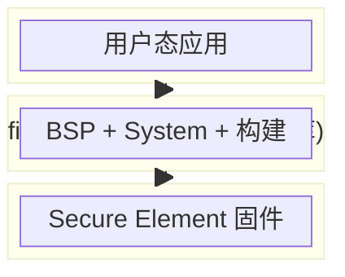

# VaultBase Firmware Monorepo

基于 Buildroot 的 VaultBase 固件仓库，目标平台 STM32MP2。

## 仓库职责划分



| 仓库 | 描述 | 状态 |
|:-----|:-----|:----:|
| **本仓库** | BSP、系统层、Buildroot 构建，产出可烧录固件 | 待定 |
| [firmware-apps](https://github.com/RevaultHQ/firmware-apps) | 用户态应用，通过 System SDK 交互 | `开源` |
| [firmware-se](https://github.com/RevaultHQ/firmware-se) | Secure Element 固件 | `闭源` |

## 产品 SKU

一套代码，两套 defconfig，分别构建独立固件。各 SKU 只包含自身所需的驱动和软件包。

| 模块 | Air | Pro |
|:-----|:---:|:---:|
| 主控 / SE / RAM / ROM / PMIC / 蓝牙 | 相同 | 相同 |
| 显示屏 | 4" LCD | 4.3" AMOLED |
| 摄像头 | ✅ (不同型号) | ✅ (不同型号) |
| 指纹 | — | ✅ |
| 电池 | — | ✅ |

## 仓库结构

```
firmware-monorepo/
├── modules/                            # 第三方上游（Git Submodules）
│   ├── buildroot/                      #   Buildroot 构建系统
│   └── buildroot-external-st/          #   ST 官方 Buildroot 扩展
│
├── bsp/                                # 板级支持
│   ├── configs/
│   │   ├── vaultbase_air_defconfig     #   Air 构建配置
│   │   └── vaultbase_pro_defconfig     #   Pro 构建配置
│   ├── board/
│   │   ├── common/                     #   共享：公共内核补丁、公共 overlay
│   │   ├── air/                        #   Air：设备树、overlay、镜像布局
│   │   └── pro/                        #   Pro：设备树、overlay、镜像布局
│   └── package/                        #   自定义驱动包（按 SKU 选配）
│
├── system/                             # 系统层
│   ├── services/                       #   核心服务（SE 通信、加密存储、OTA）
│   ├── framework/                      #   App SDK、HAL
│   └── ui/                             #   系统启动器（Qt）
│
├── Makefile                            # 构建入口
├── .github/workflows/build.yml         # CI
└── .gitmodules
```

## 构建

### 环境要求

- Linux x86_64 或 AArch64
- 25 GB+ 可用磁盘
- `build-essential` `libncurses-dev` `device-tree-compiler` `dosfstools` `mtools`

### 快速开始

```bash
git clone --recurse-submodules https://github.com/RevaultHQ/firmware-monorepo.git
cd firmware-monorepo
make build
```

构建产物位于 `modules/buildroot/output/images/`。

### 烧录

使用 STM32CubeProgrammer 通过 USB DFU 烧录，所需文件均在 `output/images/` 中：

- `flash_full.tsv` — 烧录布局
- `tf-a-*-programmer-usb.stm32` — TF-A 引导
- `fip-*-programmer-usb.bin` — FIP 镜像
- `emmc_full.img` — 完整 eMMC 镜像

### CI

GitHub Actions 手动触发（`workflow_dispatch`），三级缓存加速：

| 缓存 | 作用 |
|:-----|:-----|
| output | 完整构建产物，Buildroot stamp 增量构建 |
| dl | 源码包，跳过重复下载 |
| ccache | 编译器缓存，加速重编译 |

冷启动 ~2h，增量构建 ~10min。

## License

TBD
